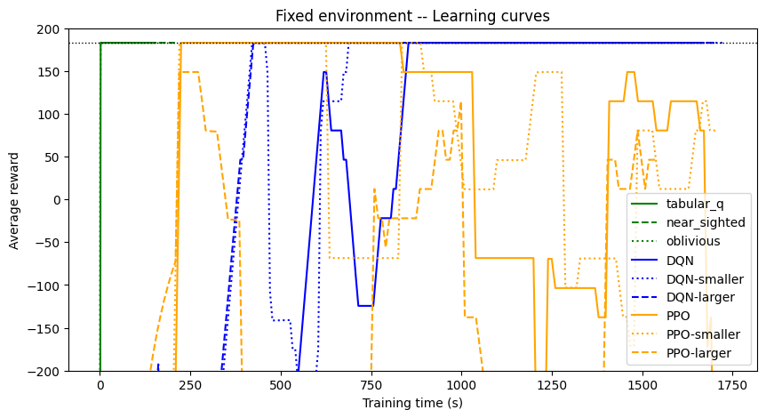

# Reinforcement Learning Project Report

## Project scope

### Task to solve: Treasure Hunt

The hero (controlled by the AI agent) must traverse a grid-based 10x10 board to reach a treasure, located at the other end of the board. To do so, they must avoid some monsters (controlled by the environment). Monster movement patterns may vary across experiments, but different movement patterns are considered to be different environments, at least for now.

### Approach to Reinforcement Learning

All the approaches we use for this project are based on Q-Learning. The main principle of Q-Learning is that for each (observable) state of the environment, the agent will learn through experience to predict the expected overall reward of each possible action. The original Q-Learning algorithm does this explicitly, storing the learned value of each action for each state; this has a strong memory usage which can easily grow unmanageable, but the observation space for our problem is manageable for a few monsters. The more modern versions of Q-Learning rely on a neural network to predict the value of each action.

## Code Structure

The project consists of two main submodules:

1. **Agent**: Contains implementations of various reinforcement learning agents, mainly tabular Q-learners, simplified learners. Neural network-based solutions are also explored, but are used directly from stable-baselines3.
2. **Environment**: Implements multiple variants of the treasure hunt environment, each introducing increasing levels of difficulty and complexity. It also includes wrappers to adapt the environment's observation space for compatibility with neural network-based agents.

Some helpers classes and functions are also included to manage running an agent against an environment. These were not put in a separate submodule for simplicity, but if they grow any more, they could justify a new submodule.

## Experiments

Key criteria include average cumulative reward over an episode, time (virtual and real) to solve the environment, and success rate in reaching the treasure. Virtual time is counted in *epochs*, which for this project are defined as runs of 10 000 training steps, after which an intermediate evaluation is performed. The number of episodes in each evaluation  is dynamically adjusted, so that more runs are performed when the variance of episodes' cumulative rewards is higher, in order to smooth out the learning curves without spending too much time evaluating.

Due to personal constraints, the training time for each agent was rather limited, so very little hyperparameter optimization was practically possible.

### Agents

- **Tabular Q agent**: the basic Q-Learning agent. It stores its best guess of each action's value for each state, which it updates every time it takes the action, based on the best action value of the new state.
- **Oblivious Q agent**: a variant of the basic tabular Q agent, which ignores the position of the monsters in its table. This helps address the problem of the size of the observation space, at the obvious cost of sometimes running into monsters and failing to reach the treasure.
- **Near-sighted Q agent**: another variant of the tabular Q agent, this agent sees the monsters in a simplified way. Each monster is either far behind, close or far ahead on each axis, meaning that each monster is only a factor 9 in terms of observation space.
- **stable-baselines3's  DQN and PPO**: Deep-Learning Q agent using stable-baselines3's implementation. According to its documentation, it implements "vanilla" Deep Q-Learning, but still includes generic RL tricks like a replay buffer. PPO is a more advanced version of deep reinforcement learning. Both are run with the default parameters, and with a smaller and larger network using respectively half and twice the neurons per layer.

### Environments

Agents are trained using progressively more complex versions of the environment to assess their learning performance.

- **Fixed Environment**:
In this environment, only the hero moves. The monsters and the hero always spawn in the same spots, with no room for randomness (on the environment's side). This environment is mostly designed as a sanity check, to verify that agents are able to solve the most basic version of the environment. Since the only difficulty here is to avoid running into walls (and the two monster spots) and reach the treasure, it also provides information on how long it takes to learn basic navigation in the treasure hunt environments.
- **Randomized Initialization**:
   This second environment implements the randomized initialization of the hero's and the monsters' positions, but the monsters are still static. This aims to test if the agents are able to handle different situations and how much longer they take to solve them.
- **Random Monster Movement**:
   This environment has moving monsters, but their movement is slow and random. A lucky hero may be able to sneak by a monster, but over time, the threat of possibly being caught should be enough to discourage agents from employing this risky tactic.

## Results

### Fixed environment
The figure below shows the learning curves for all agents in the fixed environment. The dotted black line shows the threshold for a perfect solve with the current reward structure, i.e. 200 for the treasure - 17 * 1 for each step before reaching the treasure. The curves are smoothed over a 20 epochs sliding window to help readability. The graph is cropped at -200 reward to focus on the insteresting part of the learning curve (below that point, the agents are mostly running repeatedly into walls). 

In this basic environment, tabular agents (green) perform extremely well, learning the environment by the end of the second epoch. They are also much faster per epoch, completing the planned 2000 epochs in about 1/10th of the half an hour time budget, when the neural network agents only reach about the 200th epoch.

Surprisingly, the NN agents have quite a hard time learning this basic version of the environment, especially compared to later environments, and an even harder time stabilizing. While all 3 of the DQN agents (blue) eventually reach a perfect solve, the PPO agents (orange) regress dramatically even though one of the algorithm's design aims is to limit performance loss, and they don't stabilize within the time budget.

### Stationary Monsters Environment
On this graph, the dotted black line no longer represents the hard upper limit for cumulative rewards, as the hero can spawn closer to the treasure, thus wasting less time. Instead, it is the upper limit of the worst solvable initialisation (i.e., hero in the corner oposite to the treasure).

In this environment, the tabular variants very quickly reach a decent level of performance, but never actually solve the environment due to their limited perception, which leads them to sometimes run into monsters. 

The tabular agent with no observation reduction doesn't show up on the graph: it was still slowly improving up to -400 cumulated reward by the end of the 2000 epochs. It is likely that its exploration parameter decayed too fast for it to find the treasure in a significant number of setups, resulting in a suboptimal strategy of trying to run into monsters to avoid wandering for the entire episode.

PPO-based agents reach good levels of performance within 5 minutes of training, while DQN agents take longer. It appears that the larger networks learn a bit faster, but this could be due to a luckier initialization. All NN-based agents appear to stabilize close to the performance limit, with the large DQN doing marginally better.

### Random Monsters Environment

In this environment, tabular agents seem to take almost twice as long to run 2000 epochs than on previous environments. While cache issues could have explained the difference for the full tabular agent, given that it affects the small spaces as well, it is more likely due to external factors in the runtime environment (perhaps power saving modes). 

The tabular variants still learn very fast, but their eventual average reward is lower, due to monsters now being able to catch the hero on their turn as well.
The base tabular agent does a lot better than in the previous environment, although it was clearly still learning the environment when it reached its epoch limit.

In this environment, NN agents overall learn much faster than in the previous environment, despite the added difficulty. It is possible that the monsters' movement increased connectivity between states and let agents train on a more diverse set of positions, leading to better generalisation. Some of the NN agents learned almost as fast as the simplified tabular agents, but this doesn't seem tied to a clear factor, as both larger and smaller networks took more time to stabilize as well.

## Discussion

### Potential Developments

- **Complex Movement Patterns**: An easy-to-implement next step would be to indroduce new movement patterns for the monsters, as this only requires implementing the monsters' strategy. The harder environments would likely show more differences between the various agents and their ability to solve harder tasks.
- **More monsters**: Focussing on 2 monsters was done so that the observation spaces remained manageable. As each additional monster increases the space by a factor of about 100, this could further showcase the difficulties with tabular Q-learning.
- **Efficient Observation Handling**: The environment has symmetries. First, an axial symmetry along the diagonal, and second, the order of monsters is unimportant. These redundancies could be exploited in order to speed up learning and raise the observation space cap for the tabular Q-learners.
- **Fallback Q-learner**: A possible solution to the large observation would be to have several levels of observation simplification, where the higher levels of abstraction are used when insufficient data is available on the detailed versions. 
- **Advanced Exploration Strategies**: The exploration decay in both types of agents is based solely on the number of steps taken. A more refined strategy could adjust the exploration rate dynamically based on the agent's success and how well known the current region of the observation space is.
- **Transfer learning**: The increasing difficulty of environments suggests a possible path using transfer learning between a simple environment to the next, so that for example basic movement doesn't need to be relearned for each monster position.

### Hindsight opportunities
- *Coordinates representation*: in the observations and the internal state of the environments, 2D coordinates were agregated as a single number instead of as a pair. This was done based on a previous RL project using different libraries, in the optics of making it easier to pass the observations to a neural network's input layer, but it turned out counter-productive: an adapter was still necesary for the DQN agent, and this required more complex logic to handle in many places.
- *Observation adapters*: Because the *oblivious* and *near-sighted* q-learner were first conceived as variations on the basic tabular q-learner, the observation reduction was implemented as part of the `agent` submodule, but the DQN required an environment wrapper instead, which logically went to the other submodule. This resulted in similar functionnality being split across different modules.
- *Near-sighted learner*: while the idea of caring less about far-away monsters is probably sound, the choice for discretisation lacked critical detail at close-range (even which direction the monster is in). In practice, this makes the agent "panic" and know that a monster is close, but not how to avoid it.